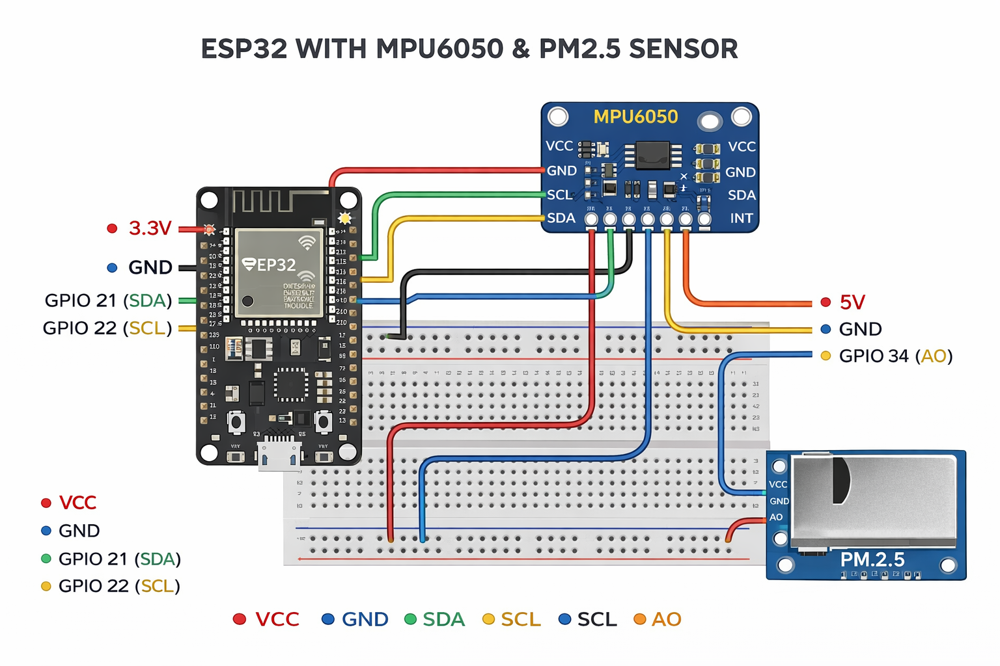
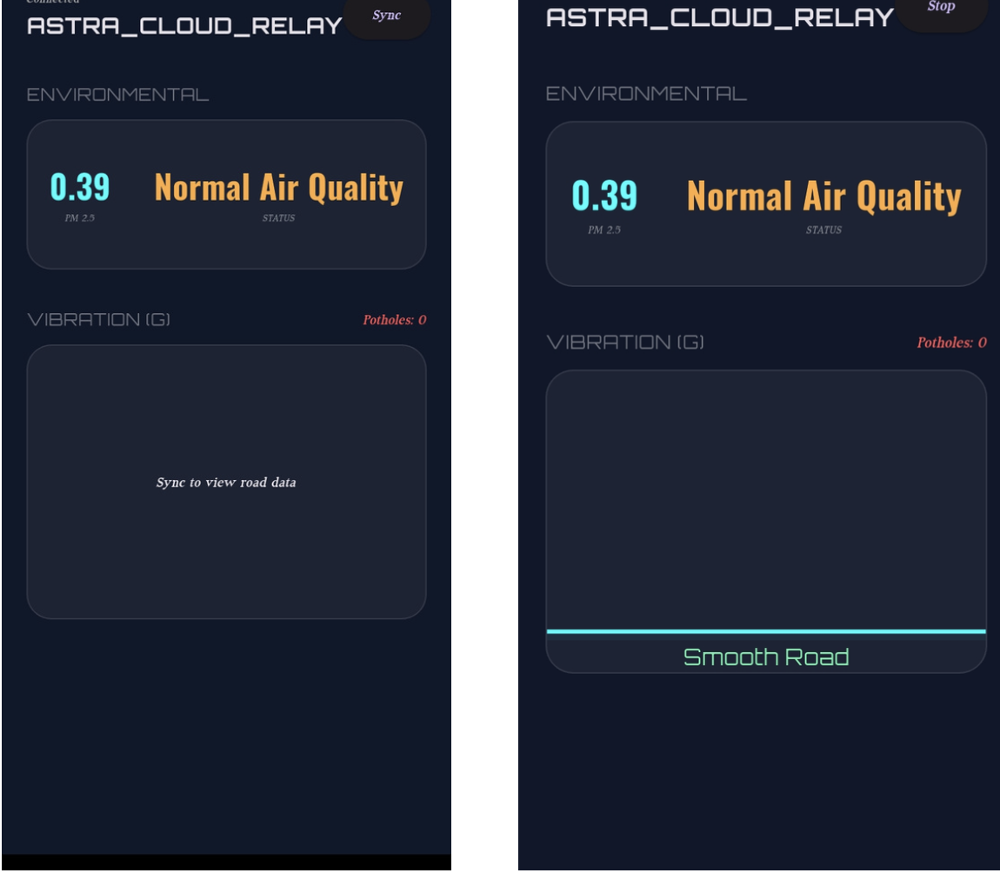
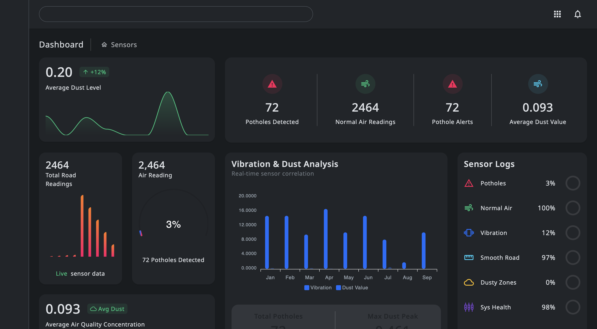

# 🌍 Project Astra  
## Data-Driven Real-Time Air Pollution Analytics & Pothole Detection Solution

Project Astra is a smart, scalable, and low-cost urban monitoring system designed to analyze **air pollution** and **road conditions (potholes)** in real time. It leverages sensor data, mobile connectivity, cloud infrastructure, and machine learning to enable **smarter cities, safer roads, and a cleaner environment**.

---

## 📌 Problem Statement

Urban environments face increasing challenges related to environmental pollution and deteriorating road infrastructure.

### Key Issues
- Health risks caused by poor air quality  
- Delayed identification of air pollution hotspots  
- Manual and reactive road condition monitoring  
- Increased accidents due to potholes  
- High maintenance costs for road infrastructure  
- Lack of real-time, localized data for authorities  

---

## 💡 Proposed Solution

Project Astra introduces a **sensor-based real-time monitoring system** that continuously collects environmental and road data, transmits it via mobile devices, and analyzes it using cloud-based machine learning models.

### Solution Highlights
- Continuous sensor data collection  
- Bluetooth-enabled data transfer to mobile application  
- Cloud-based analytics and ML processing  
- Real-time severity detection and alerts  
- No heavy hardware dependency  
- Low-cost and scalable design  

---

## 🔄 Data Workflow (PDF)

The complete system workflow, including **sensor-to-cloud data flow, mobile gateway, ML processing, and alert mechanism**, is documented in the PDF below:

📄 **[View System Workflow (PDF)](docs/workflow.pdf)**

> This workflow explains how data moves from sensors → mobile app → cloud → ML model → alerts.

---

## 🧩 System Architecture

The system follows a **sensor-to-cloud architecture**:

1. **Sensors**
   - Environmental sensors for air quality monitoring
   - Road sensors for vibration and pothole detection

   

2. **Mobile Gateway**
   - Acts as an interface between sensors and cloud
   - Transfers data using Bluetooth and mobile network

3. **Cloud Processing Layer**
   - Receives and processes incoming sensor data
   - Handles API routing and data storage

4. **Machine Learning Model**
   - Analyzes air pollution severity
   - Detects potholes and road damage patterns

5. **Alert & Notification System**
   - Sends Email/SMS alerts to concerned authorities

---

## 📱 Mobile Astra Application

The **Mobile Astra App** provides real-time insights including:
- Air quality status
- Pothole count
- Road condition analysis
- Sensor-based data visualization

The app ensures quick and accurate monitoring through a smart and user-friendly interface.

---

## 📊 Astra Web Dashboard

The **Astra Dashboard** offers a centralized monitoring platform displaying:
- Real-time air quality readings
- Pothole detection statistics
- Vibration and dust analysis
- Alerts and system health indicators

This dashboard helps authorities make efficient, data-driven decisions.

---

## 🤖 Void AI (Chat Assistant)

Void AI is an integrated chat assistant that:
- Allows users to interact with the system
- Provides instant responses and guidance
- Enhances usability and system accessibility

---

## 🚀 Feasibility & Scalability

### Feasibility
- Uses commonly available sensors and smartphones
- Requires minimal infrastructure
- Fully software-driven implementation

### Scalability
- Can be deployed city-wise or zone-wise
- Supports multiple sensor nodes
- Easily scalable through cloud infrastructure

---

## 🎯 Impact & Benefits

### Benefits
- Improved air quality monitoring
- Early detection of road damage
- Reduced accidents and health risks
- Cost-effective maintenance planning

### Stakeholders
- Municipal corporations
- Traffic and environment departments
- Citizens

---

## 🏁 Conclusion

Project Astra provides:
- A real-time, data-driven urban monitoring system
- Efficient sensor-to-cloud communication
- Machine learning-based severity detection
- Reliable alert mechanisms

### Outcomes
- Smarter cities
- Safer roads
- Cleaner environment

---

## 🔮 Future Scope

Planned enhancements include:
- Predictive air pollution and road damage forecasting
- Public awareness mobile application
- Integration with government dashboards
- Advanced analytics and reporting tools

---

## 👥 Team

**Team Name:** VoidFillers
